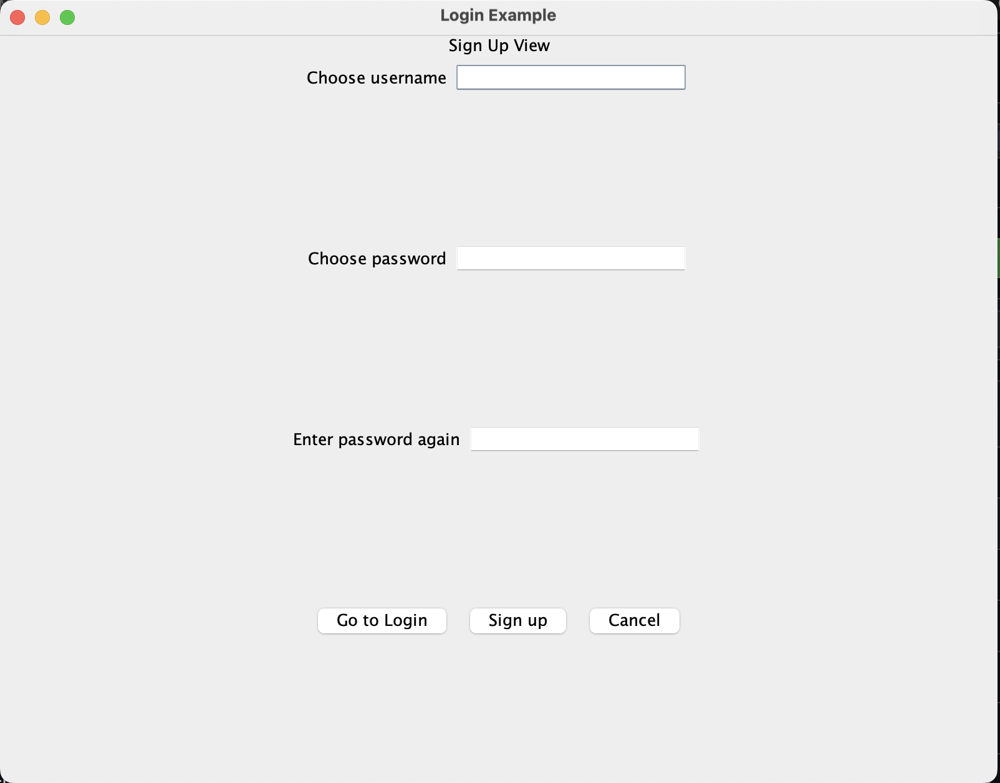
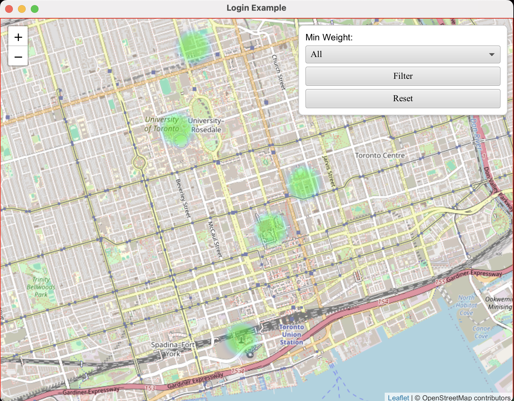
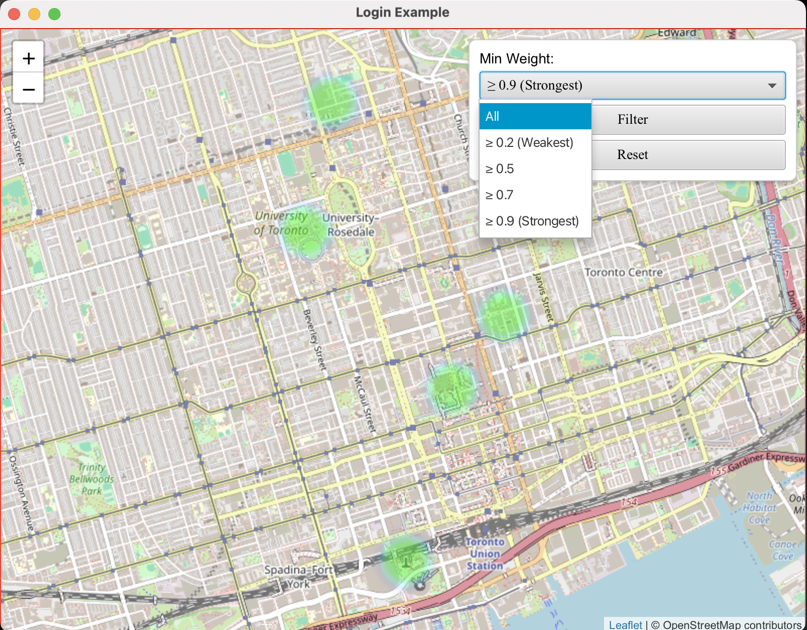
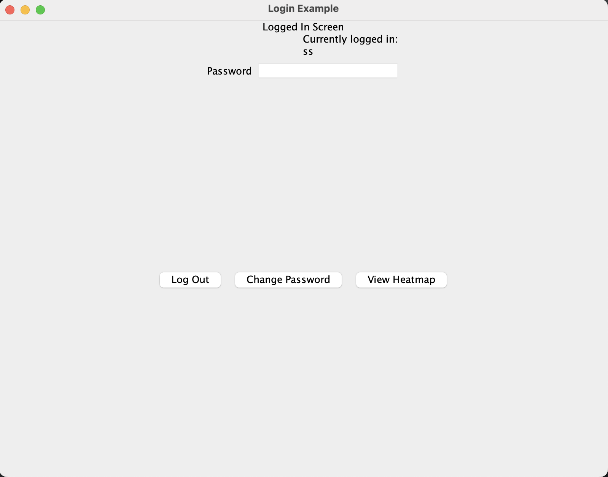

# Group 6: Heatmap

# Event Heatmap Visualization Application

A Java-based desktop application that provides interactive heatmap visualization of event data with user authentication and real-time data filtering capabilities.

## Table of Contents
- [Authors and Contributors](#authors-and-contributors)
- [Project Summary](#project-summary)
- [Features](#features)
- [Installation Instructions](#installation-instructions)
- [Usage Guide](#usage-guide)
- [License](#license)
- [Feedback](#feedback)
- [Contributing](#contributing)

## Contributors

**Team Members:**
- **Syed Rizvi** (GitHub: ItzDeys)
- **Sam Akbarian** (GitHub: samakba)
- **Reza Rehman** (GitHub: dubzsol)

*Both contributors were equally involved in all aspects of the project development.*

## Project Summary

### What This Project Does
The Event Heatmap Visualization Application is a desktop software that allows users to visualize event data through interactive heatmaps on geographical maps. Users can authenticate into the system, view event intensity across different locations, and filter data based on various criteria.

### Why This Project Was Made
This project was developed to address the need for intuitive visualization of geographical event data. Traditional data tables and charts make it difficult to understand spatial patterns in event distribution and intensity. Our application solves this by providing:
- **Visual clarity**: Immediate understanding of event concentration areas
- **Interactive exploration**: Real-time filtering and navigation capabilities
- **User-friendly interface**: Accessible to both technical and non-technical users

### Problem This Project Solves
The application is ideal for users who need to:
- Analyze event distribution patterns across geographical areas
- Identify hotspots and areas of low activity
- Filter event data based on intensity thresholds
- Present geographical data in an accessible, visual format

## Features

### **User Authentication System**
- **Sign Up**: Create new user accounts with username/password
- **Login**: Secure access with credential validation
- **Logout**: Safe session termination
- **Password Management**: Change password functionality

*Secure login interface with input validation*

### **Interactive Heatmap Visualization**
- **Real-time Data Display**: Dynamic loading of event data points
- **Color-coded Intensity**: Blue (low) to Red (high intensity) gradient
- **Pan and Zoom**: Full map navigation capabilities
- **OpenStreetMap Integration**: High-quality base maps

*LeafLet api Map + Heatpoints can be seen on the map*

### **Advanced Filtering Options**
- **Weight Thresholds**: Filter events by minimum intensity (0.2 to 0.9)
- **Real-time Updates**: Instant filter application
- **Reset Functionality**: Return to original data view

*Advanced Filtering Options can be set as desired*

### **Clean Architecture Implementation**
- **Separation of Concerns**: Clear layer boundaries
- **Testable Components**: Unit test-friendly design
- **Maintainable Code**: Following SOLID principles

## Installation Instructions

### **System Requirements**
- **Operating System**: Windows 10+, macOS 10.15+, or Linux Ubuntu 18.04+
- **Java Development Kit**: JDK 24 or higher
- **Memory**: Minimum 4GB RAM (8GB recommended)
- **Storage**: 500MB free disk space

### **Required Software and Packages**

**Essential Downloads:**
1. **Java JDK 24** - [Download here](https://www.oracle.com/java/technologies/downloads/)
    - Version: 24 or higher
    - Required for running the application
2. **Apache Maven 3.8+** - [Download here](https://maven.apache.org/download.cgi)
    - Version: 3.8 or higher
    - Required for dependency management
3. **IntelliJ IDEA** (recommended) - [Download here](https://www.jetbrains.com/idea/)
    - Version: 2023.1 or higher
    - Alternative: Any Java IDE supporting Maven

### **Step-by-Step Installation**

**1. Clone the Repository**

[Download here](https://github.com/samakba/Group_6)

**2. Set Up Development Environment**
- Open IntelliJ IDEA
- Select "Open" and navigate to the cloned project folder
- Go to `File → Project Structure`
- Set Project SDK to Java 24
- Ensure Module language level is set to "24 - Preview features"

**3. Configure Maven Dependencies**

### **Running the Application**

**Method 1: Through IDE**
- Navigate to `src/main/java/app/Main.java`
- Right-click and select "Run Main.main()"

**Method 2: Through Maven**

**Method 3: Command Line**

## Usage Guide

### **Getting Started Tutorial**

**Step 1: Launch and Sign Up**
1. Run the application using any method above
2. Click "Sign Up" on the welcome screen
3. Enter a unique username and secure password
4. Click "Create Account"

*Creating a new user account*

**Step 2: Login to Access Features**
1. Enter your credentials on the login screen
2. Click "Login" to access the main dashboard
3. You'll see the logged-in view with navigation options

**Step 3: View Heatmap Visualization**
1. Click "View Heatmap" button in the main interface
2. Wait for the map to load (shows Toronto area by default)
3. Observe color-coded event intensity points

*Click on view HeatMap*

*Interactive heatmap showing event data intensity*

**Step 4: Filter Data by Intensity**

1. Locate the filter panel in the top-right corner
2. Select minimum weight threshold:
    - "All" - Shows all data points
    - "≥ 0.2" - Shows weakest events and above
    - "≥ 0.5" - Shows moderate intensity and above
    - "≥ 0.7" - Shows high intensity events
    - "≥ 0.9" - Shows only strongest events

*Click Filter*

3. Click "Filter" to apply changes
4. Use "Reset" to return to original view

**Step 5: Navigate the Map**
- **Pan**: Click and drag to move around
- **Zoom**: Use mouse wheel or zoom controls
- **View Details**: Hover over colored areas to see intensity levels

## License
This project is licensed under the **MIT License**.

MIT License

Copyright (c) 2025 Syed Rizvi & Sam Akbarian

Permission is hereby granted, free of charge, to any person obtaining a copy
of this software and associated documentation files (the "Software"), to deal
in the Software without restriction, including without limitation the rights
to use, copy, modify, merge, publish, distribute, sublicense, and/or sell
copies of the Software, and to permit persons to whom the Software is
furnished to do so, subject to the following conditions:

The above copyright notice and this permission notice shall be included in all
copies or substantial portions of the Software.

THE SOFTWARE IS PROVIDED "AS IS", WITHOUT WARRANTY OF ANY KIND, EXPRESS OR
IMPLIED, INCLUDING BUT NOT LIMITED TO THE WARRANTIES OF MERCHANTABILITY,
FITNESS FOR A PARTICULAR PURPOSE AND NONINFRINGEMENT. IN NO EVENT SHALL THE
AUTHORS OR COPYRIGHT HOLDERS BE LIABLE FOR ANY CLAIM, DAMAGES OR OTHER
LIABILITY, WHETHER IN AN ACTION OF CONTRACT, TORT OR OTHERWISE, ARISING FROM,
OUT OF OR IN CONNECTION WITH THE SOFTWARE OR THE USE OR OTHER DEALINGS IN THE
SOFTWARE.

**License Details:**
- ✅ Free to use for personal and commercial purposes
- ✅ Modification and distribution permitted
- ✅ Attribution required
- ❌ No warranty provided

## Feedback
We welcome all feedback to improve our Event Heatmap Visualization Application!
### **How to Submit Feedback**
**Primary Method: GitHub Issues**
- Visit our [GitHub Issues page](https://github.com/samakba/Group_6)
- Click "New Issue"
- Select appropriate issue template:
    - 🐛 Bug Report
    - ✨ Feature Request
    - ❓ Question/Support
    - 📝 Documentation Improvement

**Alternative Method: Email**
- Send detailed feedback to: 
- Include screenshots or error logs when relevant

### **Feedback Guidelines**
**What Makes Good Feedback:** ✅ Specific descriptions of issues or suggestions ✅ Steps to reproduce problems ✅ Screenshots or error messages ✅ Information about your system (OS, Java version) ✅ Constructive suggestions for improvement
**What to Expect:**
- **Response Time**: Within 2-3 business days
- **Bug Fixes**: Critical bugs addressed within 1 week
- **Feature Requests**: Evaluated and prioritized monthly
- **Updates**: Progress communicated through GitHub issues

**Valid Feedback Categories:**
- Functionality bugs or errors
- User interface/experience improvements
- Performance optimization suggestions
- Documentation clarifications
- Feature enhancement requests

## Contributing
We welcome contributions from the community! Here's how you can help improve our project.
### **How to Contribute**
**Step 1: Fork the Repository**
1. Visit our [GitHub repository](https://github.com/samakba/Group_6)
2. Click the "Fork" button in the top-right corner
3. This creates a copy of the project in your GitHub account

**Step 2: Clone Your Fork**

**Step 3: Create a Feature Branch**

### **Development Guidelines**
**Code Standards:**
- Follow existing code style and formatting
- Add comments for complex logic
- Write unit tests for new features
- Use meaningful variable and method names

